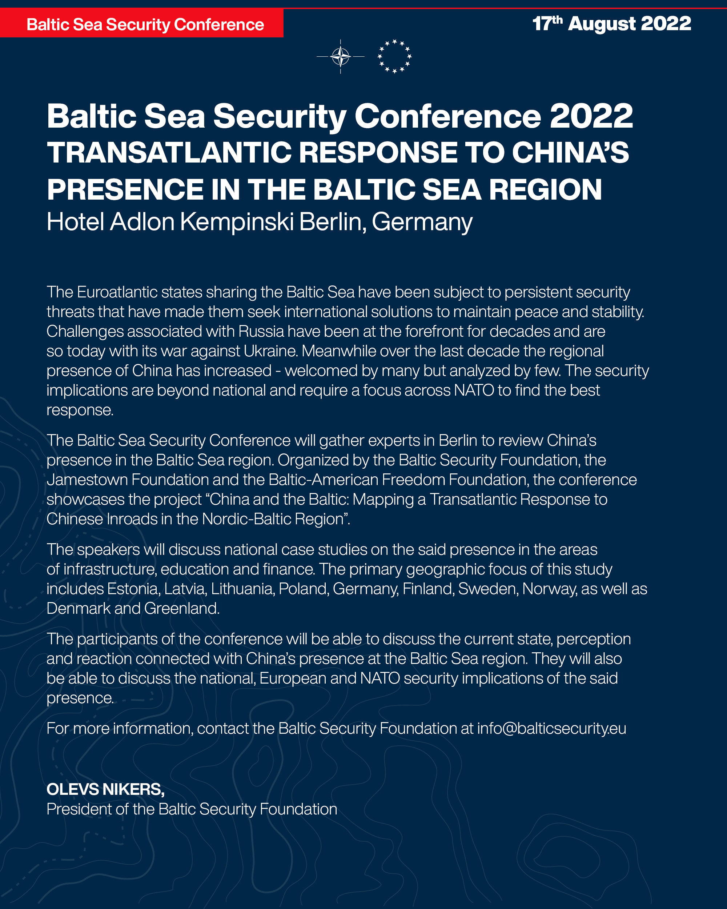
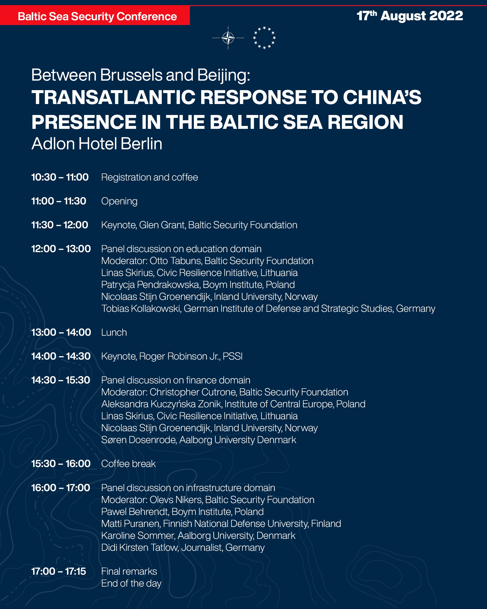

**Transatlantic response to China’s presence in the Baltic Sea Region**

The Euroatlantic states sharing the Baltic Sea have been subject to persistent security threats that have made them seek international solutions to maintain peace and stability. Challenges associated with Russia have been at the forefront for decades and are so today with its war against Ukraine. Meanwhile over the last decade the regional presence of China has increased - welcomed by many but analyzed by few. The security implications are beyond national and require a focus across NATO to find the best response.

The Baltic Sea Security Conference will gather experts in Berlin to review China’s presence in the Baltic Sea region. Organized by the Baltic Security Foundation, the Jamestown Foundation and the Baltic-American Freedom Foundation, the conference showcases the project “China and the Baltic: Mapping a Transatlantic Response to Chinese Inroads in the Nordic-Baltic Region”. The speakers will discuss national case studies on the said presence in the areas of infrastructure, education and finance. The primary geographic focus of this study includes Estonia, Latvia, Lithuania, Poland, Germany, Finland, Sweden, Norway, as well as Denmark and Greenland.

The participants of the conference will be able to discuss the current state, perception and reaction connected with China’s presence at the Baltic Sea region. They will also be able to discuss the national, European and NATO security implications of the said presence.

For more information, please visit the website <[www.balticsecurity.eu](www.balticsecurity.eu)> or write us to the
following address: <[info@balticsecurity.eu](info@balticsecurity.eu)>.

_OLEVS NIKERS, President of the Baltic Security Foundation_

# [Register here](https://forms.gle/xFfWVPHLvPsTydRV7)

<!-- Conference Program [PDF](../images/Baltic_Sea_Security_Conference.pdf) -->

**10:30 – 11:00** Registration and coffee  
**11:00 – 11:30** Opening  
**11:30 – 12:00** Keynote, Glen Grant, Baltic Security Foundation  
**12:00 – 13:00** Panel discussion on education domain  
Moderator: Otto Tabuns, Baltic Security Foundation  
Lukas Andriukaitis, Civic Resilience Initiative, Lithuania  
Patrycja Pendrakowska, Boym Institute, Poland  
Nicolaas Stijn Groenendijk, Inland University, Norway  
Tobias Kollakowski, German Institute of Defense and Strategic Studies, Germany  
**13:00 – 14:00** Lunch  
**14:00 – 14:30** Keynote, Roger Robinson Jr., PSSI  
**14:30 – 15:30** Panel discussion on finance domain  
Moderator: Christopher Cutrone, Baltic Security Foundation  
Aleksandra Kuczyńska Zonik, Institute of Central Europe, Poland  
Linas Skirius, Civic Resilience Initiative, Lithuania  
Nicolaas Stijn Groenendijk, Inland University, Norway  
Søren Dosenrode, Aalborg University Denmark  
**15:30 – 16:00** Coffee break  
**16:00 – 17:00** Panel discussion on infrastructure domain  
Moderator: Olevs Nikers, Baltic Security Foundation  
Pawel Behrendt, Boym Institute, Poland  
Matti Puranen, Finnish National Defense University, Finland  
Karoline Sommer, Aalborg University, Denmark  
Didi Kirsten Tatlow, Journalist, Germany  
**17:00 – 17:15** Final remarks  

## Biographies:

**Dr. Aleksandra Kuczyńska-Zonik** is the head of the Department of the Baltics at the Institute of Central Europe. She is also a Research Assistant at the John Paul II Catholic University of Lublin, Poland. She holds Ph.Ds from the Faculty of Political Science at the Maria Curie-Skłodowska University in Lublin, Poland (2015) and from the Faculty of Sociology and History at the University of Rzeszów, Poland (2013). Didi Kirsten Tatlow is a journalist, former senior Fellow at the Asia Program at the German Council on Foreign Relations (DGAP) in Berlin, Germany, and a Senior Non-Resident Fellow at Projekt Sinopsis in Prague, Czechia. She researches, speaks and publishes widely on the political system of China and its impact on Europe, technology and worldwide transfer, democratic security, ideology, disinformation, Taiwan and Hong Kong.

**Karoline Sommer**, M.Sc. in Administration (Cand.scient.adm.), has a degree from the University of Greenland, Ilisimatusarfik and did her master thesis about U.S. Military presence in Greenland, the defense agreement from 1951 between U.S and Denmark about defense of Greenland and environmental issues. As University student Karoline was former member of independent documentation group about foreign and security policy in Greenland between U.S. and Denmark during the 2nd World War and the Cold War. Karoline’s scientific area is the Great Power Rivalry in the Arctic and the security implications.

**Lukas Andriukaitis**, Board member of Civic Resilience Initiative (CRI); Associate Director at the Atlantic Council’s Digital Forensic Research Lab; Associate Analyst at the Vilnius Institute for Policy Analysis; former officer at Special Purpose Service of the Lithuanian Special Operations Forces; Deputy Head of the Strategic Planning Division at the State Railway Inspectorate under the Ministry of Transport and Communication.

**Linas Skirius** is co-founder of the Civic Resilience Initiative, Lithuania.

**Dr. Matti Puranen** is a Senior Researcher at the Finnish National Defense University, where he conducts research on Chinese foreign relations and military strategy.”

**Dr. Nico Groenendijk** is professor of public policy, organization and innovation, at Inland University, Norway. From 2018-2021 he was associated with OsloMet University, first as a Marie Skłodowska-Curie fellow, working on a two-year project on the governance of the European patent system, later as professor, doing research on sustainability and public procurement. He was also visiting professor in European Studies, at the Johan Skytte Institute of Political Studies, University of Tartu (Estonia), from 2014-2021.

**Otto Tabuns** is director of the Baltic Security Foundation. He instructs at the Riga Graduate School of Law and co-hosts the Latvia Weekly show on current political affairs. With a background in international law and political science, Tabuns has worked on foreign and defense policy for ten years between the public service and European and American non-governmental organizations. He is a co-editor of four books on regional security, most recently finishing "Baltic Sea Security: regional and sectoral perspectives".

**Pawel Behrendt** is a Political Science PhD candidate at the University of Vienna. He is Chair of the Board at the Boym Institute in Warsaw and a regular contributor to konflikty.pl.

**Patrycja Pendrakowska** is the head and the founder of the Boym Institute of Asian and Global Studies in Warsaw. At the Boym Institute she is predominantly focused on China’s domestic and foreign policy, the BRI and 17+1. Patrycja Pendrakowska is also a PhD Candidate at the Humboldt University in Berlin, and teaches Political ideas in China at the University of Warsaw, Faculty of Philosophy. She graduated from financial law, ethnology, philosophy and sinology at the University of Warsaw.

**Dr. Søren Dosenrode** is head, Regional and International Studies (REGIS), Aalborg University (Denmark) and founder of the Aalborg Center for European Studies where he holds the position of research director.

**Tobias Kollakowski** is research Fellow at German Institute of Defense and Strategic Studies.

Full posters:

