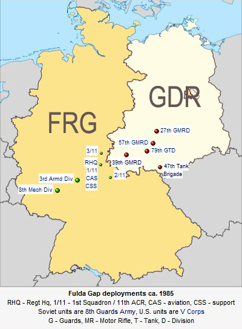
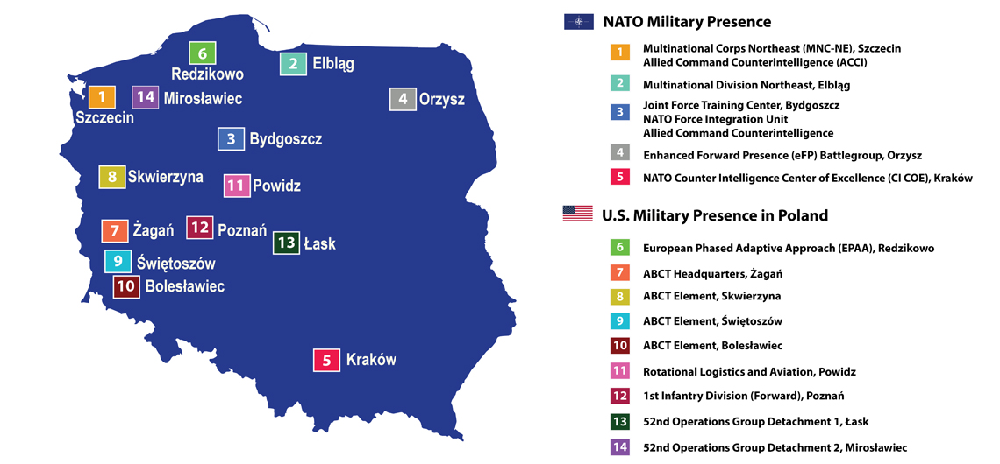

In June the Trump administration announced its decision to pull 9,500 U.S. troops from Germany. The move was lambasted by those on the left and right alike, and indeed, at face value, it appeared counterintuitive. Any return to the Obama and Bush-era troop drawdown in Europe would be foolish facing a revisionist Russia. But if there is anything the keen and impartial observer should know by now about this administration, it is that it keeps its cards close to the chest, absorbing the criticism that inevitably comes and only revealing its end game down the line.

Within weeks, it was announced that an additional 1,000 troops could be deployed to Poland on top of the already agreed upon 1,000 from last year’s Joint Declaration on Defense Cooperation. President Trump further intimated that more could follow. Likewise, Latvia announced that it wanted and was ready to accommodate a cut of the 9,500 leaving Germany as well. Likewise, Lithuania will be receiving hundreds of U.S. troops, including a battalion sized unit this year and a company of troops in 2022. Eventually, the Baltics may see an increased U.S. troop presence as well. On July 29, U.S. Secretary of Defense Mark Esper noted that the U.S. is considering bolstering its presence in the Baltic States, and the idea is gaining traction in the U.S. defense community. It is still not yet known what will become of the remainder of these troops – where they will be going and what they will be doing there. But we are likely beginning to see a potential strategic shift by the U.S. closer to NATO’s eastern flank. 

Much ink has been spilled about how President Trump is angry with Germany’s failure to uphold the two percent defense spending agreement in NATO. A little less has been devoted to his remarks regarding Germany’s continued pursual of Nord Stream II and closer economic relations with Russia. All of these political/diplomatic messages matter, to be sure, but what of the strategic picture? In the event of conflict, it will matter less why the troops are where they are, and more that they are where they are. The reality is this: unless Poland falls, Germany is not likely to be a frontline ally. Poland is. 

During the Cold War, West Germany was NATO’s primary Eastern boundary (Greece and Turkey also bordered the Warsaw Pact, but these zones were not as militarized). It made sense for the allies to maintain a significant military frontline presence there, facing off the Warsaw Pact. Both sides focused considerable energy on plans and preparations for invasion scenarios centered on the Fulda Gap, today in the center of reunified Germany. Today, the United States’ military presence in western Germany is far from the front line. Russian strategy tells us that this makes a difference. 

Fulda Gap Deployments ca. 1985 – Creative Commons illustration by W.B. Wilson. https://en.wikipedia.org/wiki/File:Cold_War_Germany.png

Russia is often viewed one of two ways: as a paranoid defender, facing off the specter of Western invasion, or as an opportunist, seeking to make gains in power where it is able. In reality, Russia is both of these at once. Its deluded fears of the West drive its desire for a buffer zone it can control in Ukraine, Belarus, and Moldova, as well as its desire to prevent the spread of NATO to Ukraine and Georgia. Yet, in its conflicts in Moldova, Ukraine, and Georgia, there is a clear sense of opportunism. Russia attacked swiftly in times and locations where it calculated the West would not respond strongly. To this day, Moldova’s Transnistria barely registers on anyone’s foreign policy radar in the West. Russia attacked Georgia during a lame duck presidency in an election year while the U.S. was focused on Islamist terrorism. When Russia attacked Crimea, it knew the U.S. was not particularly interested in Europe, and indeed, the U.S. still naively believed a reset with Russia could be possible. For nearly six years, the United States and Europe have done little beyond economic sanctions to seriously punish Russia or help Ukraine. Indeed, France and Germany have poised themselves to give Russia what it wants out of the protracted conflict in the Donbass with the Steinmeier Formula. 

In each of these cases, the Kremlin saw an opportunity to maintain its sphere of control through protracted armed conflict. But ultimately the strongest piece of evidence that Russia views conventional conflict primarily through the lens of opportunity is this: Russia invests most of its military resources towards offensive capabilities and tends to see purely defensive capabilities as cost prohibitive. This is further underscored by comments by Valeriy Gerasimov, Chief of the Russian General Staff, in a March 2019 speech. He emphasized that Russia sees deterrence through the lens of preemptive strike, designed to seize the initiative to destroy the enemy before it can take the initiative to launch its own attack.

This line of thinking can also be seen in Russia’s hybrid warfare strategy, in which the Kremlin seeks to destabilize and neutralize perceived threats from the West, without having to fight a conventional conflict. Strategically, Russia understands that it cannot defeat NATO in the long run in conventional war. Without wearing NATO down beforehand, setting up a fait accompli, or pursuing an “escalate to deescalate” nuclear strategy, Russia does not have the resources to defeat NATO in personnel, money, or equipment. Thus, it takes the initiative to wage asymmetric conflict in the grey zone in order to weaken NATO while economizing the use of force.

Taking Russia’s interestingly offensive deterrence strategy into perspective, NATO must recognize the need to deny Russia any opportunity for military action against member states along the Eastern Flank. As a result, a more forward presence is required than the current status quo. Facing renewed great power competition, and knowing that Russia clearly rejects the principles of the post-Cold War order, NATO should be prepared for the need to rapidly respond to a crisis in the east. For now, the threat has remained fairly low, but ensuring that Russia understands it cannot make a preemptive strike on the Baltics, Poland, or any other NATO member is critical. 

Many have suggested that a more forward posture could provoke a desperate Russia, resulting in the escalation of conflict. What we must understand, however, is that the conflict is already ongoing and is in a state of continuously fluctuating intensity. By deploying troops and equipment further east, the U.S. and NATO can simultaneously be prepared for a more rapid response to ensure no fait accompli can be achieved while signaling to Russia that the cost of aggression will be too high.

Source: U.S. Embassy Poland https://pl.usembassy.gov/nato_us/

Thus, moving troops from Germany to Poland makes strategic sense, regardless of outwardly stated objectives. It will be potentially costly, yes, but if the United States and NATO want to prevent a fait accompli in the Baltics, positioning troops and equipment in closer proximity to the Suwałki Gap (on the Polish-Lithuanian border) is crucial for the allies to come aid the Baltics quickly and prevent Russia from isolating them. The key to success in this, however, is a combination of clear strategic thinking at the upper levels and clear messaging to Russia. NATO should seek to put forth not necessarily the greatest number of troops, but the troops and equipment best suited for rapid response as a first wave into the Baltic theater, allowing for a second wave to follow from bases in Germany and beyond. Ideally, this should not involve any significant troop reduction in Europe as a whole; indeed, it may be better to increase the number of troops there. However, the numbers themselves ultimately matter less than the capabilities NATO possesses.

Much remains to be seen with respect to how many troops will be deploying further east. How many will go to Poland? Will Latvia receive any of the troops it wants? What kinds of capabilities will the U.S. focus on sending eastward? Whether or not this turns out to be good policy largely hinges on the answers to these questions. Do not expect answers soon, but keep observing. The U.S. may not be washing its hands of Europe after all. In fact, it is probably renewing its focus – this time to the east. 

Cover Photo: U.S. President Donald Trump holds a joint news conference with Poland's President Andrzej Duda in the Rose Garden at the White House in Washington, DC, June 24, 2020. Credit: Carlos Barria/Reuters

**By [Matthew Thomas](../our_team)**

