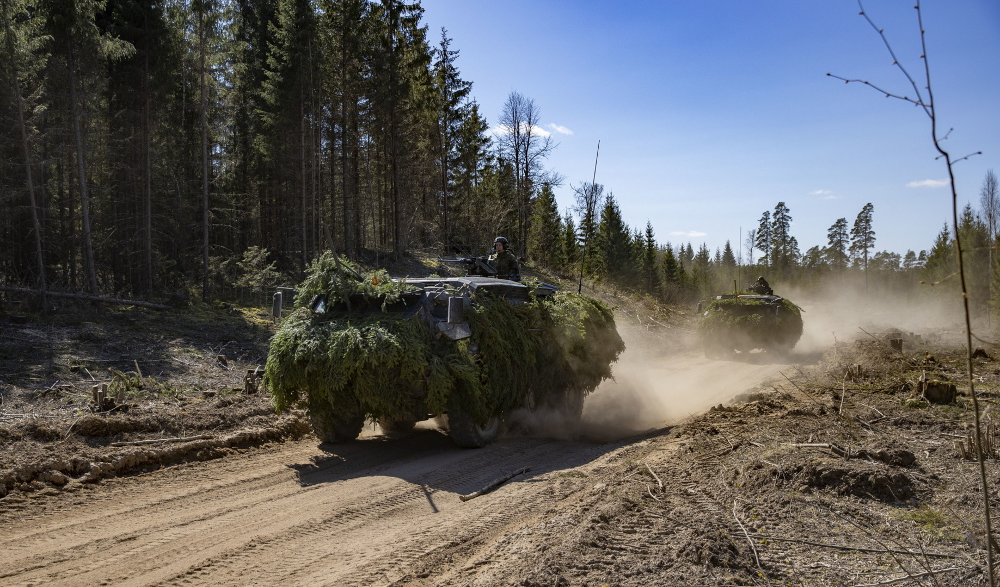

Each year, Estonia hosts Spring Storm (Kevadtorm), bringing together forces from all across NATO to conduct field and live-fire exercises. Though smaller in scale and participation due to the coronavirus pandemic, this year’s exercises concluded successfully last week. Spring Storm demonstrates Estonia and its allies’ commitment to ensuring readiness in case of attack, contributing to the credibility of NATO’s deterrence posture on the Eastern Flank.

Military exercises are crucial for training and readiness purposes, as new conscripts/recruits and reservists have an opportunity to train alongside active duty personnel. Likewise, these exercises, if put together well, provide insight into the particular advantages and disadvantages the battle space provides while also forcing organizers to think critically about realistic battle scenarios. In turn, this should inform decisions on strengths and weaknesses and help decision makers strategize procurements and formulate better response plans.

Exercises also perform a critical deterrent role. A more prepared military force is a more difficult force to defeat, and therefore less enticing to attack. In a Baltic scenario, this is even more pronounced as the defenders will be a multinational force, presenting unique challenges for command and operations. Thus, NATO must be prepared to overcome these hurdles, and this can only be done through strategic planning and extensive practice putting plans into action. The more NATO is prepared to respond in a quick and coordinated manner, the better its deterrent posture will be.

Though reduced to about a third of its scale this year, participants in Spring Storm included the United Kingdom, Denmark, the United States, the enhanced forward presence (eFP) battle group stationed in Estonia, and, of course, the Estonian Defence Forces (EDF). The Estonian Cyber Command, Air Force, and Military Police also took part in the exercises. During the field exercises at the first half of Spring Storm, the NATO allied battle group performed a red-teaming role as the enemy force. The American contribution consisted of two B-1 heavy bombers making the trip to Estonia from the continental United States as part of a 24-hour mission to practice rapid crisis response. British, Danish, and Estonian troops saw the bulk of the action this year, which largely focused on woodland infantry tactics and featured 150 units of military vehicles and equipment. The focus on woodland infantry tactics here is critical, as aside from urban scenarios in the north, infantry and combined arms operations in Estonia’s dense forests are the most likely forms of action on the ground that would be seen in the Estonian theater.

Photo credit: Ardi Hallismaa, accessed via [ERR.ee](https://news.err.ee/1082446/defense-forces-preparing-for-spring-storm-2020-combat-training-exercises#lg=1&slide=22)

Though reservists were unfortunately (and probably reasonably) unable to attend this year’s exercises, Spring Storm provided crucial training for new Estonian conscripts alongside their active duty counterparts. In order to be effective, conscripts must have training and experience. Otherwise, they may become a liability rather than a strength. As with any learned skills, military tactics and even the use of military equipment requires practice. Interoperability and the ability to effectively command multinational forces takes practice. Logistics for multinational forces in challenging geography take practice. Spring Storm demonstrates that Estonia takes its security seriously enough to train even now, albeit in a limited capacity. In turn, this willingness demonstrates to Russia that Estonia intends not to be easy pickings, and allied participation signals NATO members’ commitment to their allies’ defense.

Cover Photo: Danish troops participating in Spring Storm. [Credit](https://pildid.mil.ee/index.php?/category/59883)

**By [Matthew Thomas](../our_team)**
